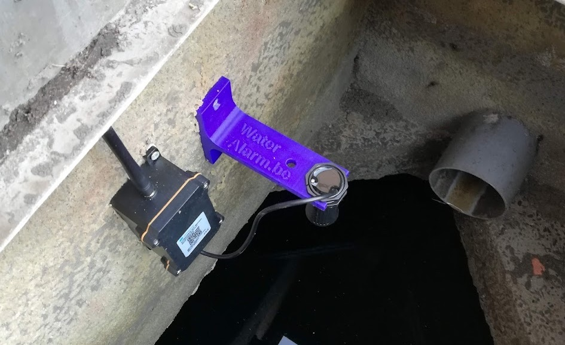

# VIVES - Graduaat Programmeren – Voortgangstoets

## Project “WAARSCHUW”
**W**ater **A**nomalie **A**larm **R**egistratie **S**ysteem voor **C**ontrole en **H**et **U**itfilteren van **W**aarden

Water wordt steeds belangrijker – en dus ook het meten van waterstanden.  Zowel een tekort aan water als een teveel ervan kan voor allerlei problemen zorgen.  Vanuit die behoefte is [wateralarm.be](https://www.wateralarm.be/) ontstaan: een platform dat mensen inzicht geeft in o.a. waterputten en grondvochtigheid.
Wat begon als een hobbyproject om Arduino aan te leren in [CoderDojo Torhout](https://torhout.coderdojobelgium.be/), groeit intussen uit tot een kleine startup.

## Context
We meten waterstanden met kleine sensoren:
- Sensor-nodes worden geïnstalleerd op locatie.
- Op vaste tijdsintervallen sturen ze meetgegevens naar een server, waar alles wordt opgeslagen in een timeseries database.
- Die gegevens worden:
  - Visueel weergegeven op een eenvoudige website.
  - Gebruikt om gebruikers te waarschuwen bij drempeloverschrijdingen.
  - Ingezet voor data-analyse en onderzoek.

## Het probleem: **Ongeldige metingen**

Soms zitten er foute metingen in de data – deze **"outliers"** of **"anomalieën"** verstoren de werking.

De foute metingen zijn duidelijk zichtbaar in onderstaande grafiek:

## Oorzaken

Voor dit project irrelevant, maar oorzaken hiervoor zijn:
- Spinnenwebben, insecten, drijvende vlotter/buizen
- Condens
- Geluid van regen op een metalen deksel
- ...

## Gevolgen:

- Valse alarmmeldingen
- Spikes in de grafieken
- Algemene vervuiling van de dataset, die data analyse moeilijk maken
Hoewel het om een beperkt aantal foute metingen gaat, zorgen ze toch voor hinder.

Let wel dat niet elke plotse stijging of daling abnormaal is – een regenwaterput kan immers snel gevuld worden, door hevige regen of manueel bijvullen.  Sommige sprongen zijn dus perfect normaal.  In de grafiek hierboven is dit ook te zien.

## **==> De opdracht <==**
- **Hoe kunnen we outliers automatisch detecteren en filteren?**
- **Kunnen we daarnaast ook andere gebeurtenissen herkennen, zoals het plots vullen of leeglopen van een put?**

## Je krijgt
- Een **CSV-bestand met metingen van 4 toestellen**:
  - `A840415930000001` bevat meerdere outliers
  - `A840416891000002` is clean, bevat geen outliers
  - `A8404142B1000003` bevat geen outliers, maar wel “circadisch” effect (zie verder)
  - `A840417207000004` is hopeloos (zie eveneens verder)
- De nuttige data is vrijwel uitsluitend de kolommen:
  - `tags`: om te bepalen over welke sensor het gaat
  - `time`: tijdstip van de meting in UTC
  - `distance`: de afstand in mm tussen de sensor en het wateroppervlak
- File: [CSV-file](data/wateralarm-vives.csv)

## Extra vereisten

- De detectiemethode moet **onafhankelijk zijn van het meetinterval** (b.v. toestel A meet om de 20 min, toestel B om de 2 uur).
- **Realtime verwerking is meegenomen, maar geen strikte vereiste**. Je mag dus enkele metingen “in de toekomst kijken”.  Of m.a.w. een meting kan dan pas als outlier gemarkeerd worden nadat enkele volgende metingen zijn binnengekomen.

## Mogelijke pistes

Het is absoluut niet de bedoeling om je in een bepaalde richting te duwen, maar mogelijkheden zijn:
- Statistische methoden zoals de **Z-score**.
- Een **double-moving-average techniek (met een moving-average vóór en na de "huidige" meting).
- **Machine Learning**, bijvoorbeeld met ML.NET.
- Inspiratie:
  - [Medium: Outlier Detection and Treatment](https://medium.com/@aakash013/outlier-detection-treatment-z-score-iqr-and-robust-methods-398c99450ff3)
  - [Detecting Anomalies with .NET and ML.NET](https://dev.to/alisson_podgurski/detecting-anomalies-with-net-and-mlnet-a-practical-guide-ng5)

## Extra uitdaging: “circadisch” effect in de metingen
De waterstand worden meestal gemeten via een ultrasone puls (“echo”).  De tijd die die puls nodig heeft om terug te keren hangt af van **de temperatuur van de lucht** boven het wateroppervlak.  De **snelheid van geluid** verandert immers bij verschillende temperaturen.  Het **zonlicht verwarmt het metalen putdeksel**, waardoor de lucht erboven opwarmt.

Dit veroorzaakt een **dagelijkse golfbeweging** in de metingen:

 
- 's Nachts lijkt het peil te stijgen
- Overdag, bij zonlicht, lijkt het te dalen.

Het zou een meerwaarde zijn om dit effect automatisch te kunnen compenseren.

Een "klassieke" manier is om gebruik te maken van **Fast Fourier Transform (FFT)** zoals gebruikt in bvb MP3-audio, met een cyclus/periode van 24 uur.

Maar ook bvb Microsoft *ml.net* biedt bepaalde ondersteuning voor dergelijke *seasonality*.

## Hopeloze gevallen

Niet alles zal corrigeerbaar zijn.  Er zijn ook sensoren die volledig messed-up zijn…
De correcte waarde (~3000l) wordt hier slechts sporadisch gemeten.
 

